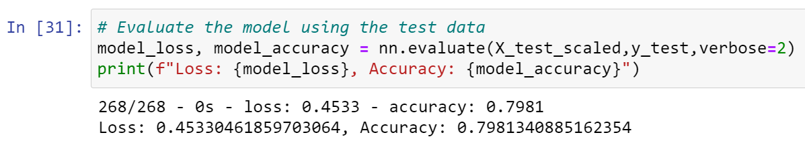

# Neural_Network_Charity_Analysis

## Overview
The purpose of this analysis is to help create a binary classifier that is capable of predicting whether applicatns will be successful if funded by Alphabet Soup. With a dataset that contains over 34,000 organizations that have received funding from Alphabet Soup over the years, a neural network model is compiled, trained, and evaluated. After that, 3 attempts were made to see if the data or model could be optimized such that it can result in over 75% predictive accuracy.

## Results
Target variable: IS_SUCCESSFUL
Features variable: Columns other than 'IS_SUCCESSFUL'
Neither targets nor features variable (removed): 'EIN' and 'NAME'

Without optimization:
Hidden layers: 2
Neurons: 12 for 1st, 8 for 2nd
Activation function (hidden layer): Relu
Activation function (output layer): Sigmoid

Result:

1st attempt:
Modification: dropped 'ORGANIZATION' column

Hidden layers: 2
Neurons: 12 for 1st, 8 for 2nd
Activation function (hidden layer): Relu
Activation function (output layer): Sigmoid

Result:

2nd attempt:
Modification: replaced 'ASK_AMT' values to 'Others' if counts are less than 5

Hidden layers: 2
Neurons: 12 for 1st, 8 for 2nd
Activation function (hidden layer): Tanh
Activation function (output layer): Sigmoid

Result:

3rd attempt:
Modification: replaced 'APPLICATION_TYPE' values to 'Others' if counts are less than 200, replaced 'CLASSIFICATION' values to 'Others' if counts are less than 300,increased neurons (30 neurons per hidden layer), used MinMaxScaler, used tanh activation function

Hidden layers: 2
Neurons: 30 for all both layers
Activation function (hidden layer): Tanh
Activation function (output layer): Sigmoid

Result:

There is no particular reasons for choosing numbers of layers and neurons. However some trials and errors were made (using up to 200 neurons per hidden layer for up to 15 layers, etc) to see if the model is underfitting or overfitting. 

After 3 attempts to optimize the model, the efforts were not enough such that its predictive accuracy reaches 75%. The model was only able to achieve 73.04% accuracy.

## Summary
After 3 attempts to optimize the model. it was only able to achieve 73.04% accuracy.